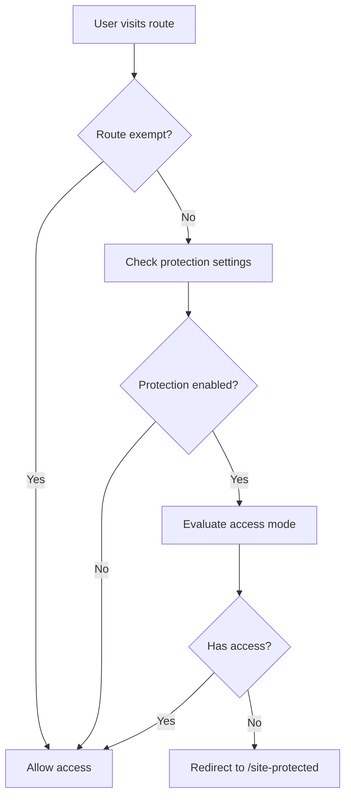
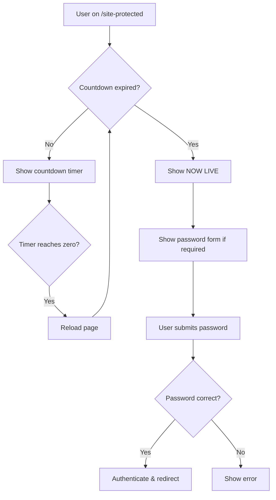
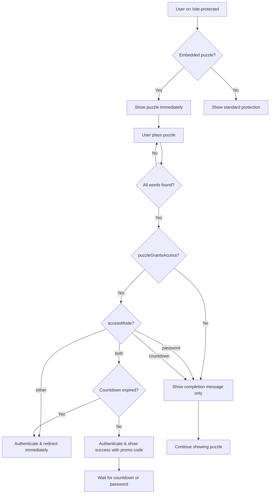

# Site Protection Service Specification

## Overview

The site protection service provides comprehensive access control for the entire application, supporting password authentication, time-based countdown access, puzzle-based authentication, and hybrid approaches. It integrates with Sanity CMS for configuration and uses Remix sessions for authentication state management.

Puzzle-based authentication allows embedding interactive Strands word puzzle games directly in the protection page. Users can play the puzzle while waiting for countdown timers, and completing the puzzle can grant access based on the configured access mode.

## Architecture

### Core Components

1. **Server-Side Guard** (`app/lib/guards/site-protection.server.ts`)
2. **Protected Page Route** (`app/routes/($locale).site-protected.tsx`)
3. **Session Management** (password and puzzle completion authentication)
4. **Sanity CMS Integration** (configuration storage)
5. **Puzzle Integration** (`app/components/protection/ProtectedPuzzleContainer.tsx`)
6. **Strands Game Component** (`app/components/games/strands-game.tsx`)

## Data Structures

### SiteProtectionSettings
```typescript
interface SiteProtectionSettings {
  enabled?: boolean;
  accessMode?: 'password' | 'countdown' | 'both' | 'either';
  password?: string;
  countdown?: string; // ISO date string
  title?: any[]; // Localized content
  message?: any[]; // Localized content
  countdownLabel?: any[]; // Localized content
  passwordLabel?: any[]; // Localized content

  // Puzzle integration
  embeddedPuzzle?: SanityStrandsPuzzle; // Full puzzle data when queried
  puzzleGrantsAccess?: boolean; // Whether completing puzzle grants access
  puzzleCompletionMessage?: any[]; // Localized message shown on completion

  redirectPage?: {
    _ref?: string;
    _type?: string;
  };
  mediaType?: 'image' | 'video';
  backgroundImage?: any;
  backgroundVideo?: any;
  overlayOpacity?: number; // 0-100
  colorScheme?: ColorScheme;
}
```

### ColorScheme
```typescript
interface ColorScheme {
  _id?: string;
  name?: string;
  background?: { hex: string; rgb: { r: number; g: number; b: number; } };
  foreground?: { hex: string; rgb: { r: number; g: number; b: number; } };
  primary?: { hex: string; rgb: { r: number; g: number; b: number; } };
  primaryForeground?: { hex: string; rgb: { r: number; g: number; b: number; } };
  border?: { hex: string; rgb: { r: number; g: number; b: number; } };
  card?: { hex: string; rgb: { r: number; g: number; b: number; } };
  cardForeground?: { hex: string; rgb: { r: number; g: number; b: number; } };
}
```

## Puzzle-Based Authentication

### Overview
Protection configurations can embed a Strands word puzzle game directly in the protected page. Users can play the puzzle immediately without needing to enter a password or wait for a countdown. Completing the puzzle acts as an authentication method that can grant access based on the configured access mode.

### Key Concepts

#### Inverted Architecture
- **Protection Config References Puzzle**: The protection configuration document references a Strands puzzle (not the other way around)
- **Reusable Puzzles**: The same puzzle can be referenced by multiple protection configs or used standalone in `/games` routes

#### Puzzle Always Accessible
- **Immediate Playability**: When a protection page has an embedded puzzle, it's immediately visible and playable
- **No Prerequisites**: Users don't need to enter a password or wait for countdown expiry to play
- **Engagement**: Provides interactive content while users wait for access

#### Puzzle Completion as Authentication
When `puzzleGrantsAccess` is enabled (default: true), completing the puzzle authenticates the user similar to entering a password. The behavior depends on the access mode:

**Access Mode: `either`**
- Puzzle completion grants **immediate full access**
- Acts as an alternative to password or countdown
- User is redirected to the protected content

**Access Mode: `both`**
- If countdown expired: Puzzle completion grants **full access**
- If countdown active: Shows **success page with completion message** (e.g., promo code)
- Acts as the password requirement in the "both" equation

**Access Mode: `password`**
- Puzzle completion does **not** grant access on its own
- Password is still required
- Puzzle provides entertainment while password is entered

**Access Mode: `countdown`**
- Puzzle completion does **not** grant access on its own
- Countdown must still expire
- Puzzle provides engagement during the wait

### Minimal Game Modifications
The Strands game component accepts optional props for protection context but maintains all its original styling and functionality:
- **Timer Display**: Only the countdown banner changes to use the protection countdown
- **Timer Text**: Changes from "Early access begins in..." to "Access expires in..."
- **Completion Callback**: Triggers authentication flow when all theme words are found
- **All Other Features**: Grid, colors, hints, theme display, etc. remain unchanged

## Access Modes

| Mode | Description | Access Logic | Puzzle Completion Behavior |
|------|-------------|--------------|---------------------------|
| `password` | Password-only protection | Requires valid password authentication | Does not grant access (puzzle is entertainment only) |
| `countdown` | Time-based protection | Requires countdown timer to expire | Does not grant access (puzzle is entertainment only) |
| `both` | Combined protection | Requires BOTH password AND countdown expiry | Acts as password; grants full access when countdown expired, shows success message if countdown active |
| `either` | Flexible protection | Requires password OR countdown expiry | Grants immediate full access (acts as alternative authentication) |

## Server-Side Guard

### Function: `requireUnprotectedAccess(context, request)`

**Purpose**: Middleware function that checks if users should have access to protected routes.

**Behavior**:
1. **Route Exemption**: Skips protection for system routes (`/cms`, `/api`, `/robots.txt`, etc.)
2. **Settings Query**: Fetches protection configuration from Sanity
3. **Protection Check**: Evaluates user access based on mode and credentials
4. **Redirect Logic**: Redirects unauthorized users to `/site-protected` with return URL

**Exempt Routes**:
- `/cms` - CMS access
- `/site-protected` - Protection page itself
- `/api/*` - API endpoints
- `/robots.txt` - SEO
- `/sitemap.xml` - SEO
- `/_assets/*` - Static assets
- `/favicon*` - Icons

## Protected Page Route

### Loader Function
**Responsibilities**:
- Query protection settings with expanded color scheme and media
- Check existing authentication state
- Determine access permissions
- Redirect if access is granted
- Return protection data for rendering

**Access Decision Logic**:
```typescript
switch (protection.accessMode) {
  case 'password': hasAccess = hasPasswordAuth; break;
  case 'countdown': hasAccess = countdownExpired; break;
  case 'both': hasAccess = hasPasswordAuth && countdownExpired; break;
  case 'either': hasAccess = hasPasswordAuth || countdownExpired; break;
}
```

### Action Function
**Responsibilities**:
- Handle password form submissions
- Handle puzzle completion submissions
- Validate passwords against Sanity settings
- Authenticate user sessions (password or puzzle completion)
- Determine post-authentication state based on access mode and countdown status
- Handle redirects or show success messages

**Action Types**:
- **Password Submission**: Traditional password form submission
- **Puzzle Completion** (`actionType: 'puzzle-completed'`): Triggered when user completes embedded puzzle

**Puzzle Completion Logic**:
```typescript
if (actionType === 'puzzle-completed' && protection.puzzleGrantsAccess) {
  // Authenticate user
  passwordSession.authenticateFor(protection._id);

  if (accessMode === 'either') {
    // Grant immediate full access
    return redirect(targetPath);
  } else if (accessMode === 'both') {
    if (countdownExpired) {
      // Full access granted
      return redirect(targetPath);
    } else {
      // Show success page with promo code
      return json({
        success: true,
        newState: 'password-granted',
        puzzleCompleted: true,
        promoCode: puzzleCompletionMessage
      });
    }
  }
}
```

### Client-Side Features

#### Countdown Timer
- **Real-time Updates**: Updates every second using `setInterval`
- **Expiry Handling**: Triggers page reload when countdown reaches zero
- **Display Logic**: Shows "NOW LIVE" when expired (prevents reload loops)
- **Format**: Days:Hours:Minutes:Seconds with zero-padding

#### UI Customization
- **Dynamic Theming**: CSS custom properties from color scheme
- **Background Media**: Support for images and videos with overlay opacity
- **Localized Content**: Multi-language support for all text fields
- **Responsive Design**: Mobile-first approach with breakpoint handling

#### Form Handling
- **Password Input**: Secure password field with validation
- **Error Display**: Shows authentication errors
- **Redirect Preservation**: Maintains intended destination URL

## Session Management

### Password and Puzzle Authentication
- **Session Type**: Server-side sessions using Remix session management
- **Authentication Methods**:
  - `passwordSession.authenticateFor(configId)` - Password or puzzle completion
  - `passwordSession.authenticateGlobally()` - Site-wide authentication
- **State Check**:
  - `passwordSession.isAuthenticatedFor(configId)` - Check specific config
  - `passwordSession.isGloballyAuthenticated()` - Check site-wide
- **Cookie Handling**: Secure session cookies with commit/destroy lifecycle
- **Puzzle Completion**: Treated identically to password authentication in session state

## Integration Points

### Sanity CMS Queries

**Protection Settings Query (with Puzzle)**:
```groq
*[_type == "settings"][0]{
  siteProtection {
    ...,
    backgroundVideo {
      ...,
      asset->
    },
    embeddedPuzzle-> {
      _id,
      _type,
      title,
      slug,
      puzzleMode,
      themeWords[] {
        word,
        isSpangram,
        difficulty,
        hint
      },
      canonicalGrid,
      gridLocked,
      gridMetadata {
        generatedAt,
        hintWordCount,
        algorithm,
        canonicalPaths
      },
      hintWords,
      theme {
        category,
        clue,
        emoji
      },
      difficulty,
      hintMode,
      timeLimit,
      scoring {
        pointsPerWord,
        spangramBonus
      },
      reward {
        enabled,
        type,
        discountCode,
        discountPercent,
        message
      },
      status,
      publishDate,
      expiryDate,
      puzzleNumber
    },
    puzzleGrantsAccess,
    puzzleCompletionMessage,
    colorScheme-> {
      _id,
      name,
      background { hex, rgb { r, g, b } },
      foreground { hex, rgb { r, g, b } },
      primary { hex, rgb { r, g, b } },
      primaryForeground { hex, rgb { r, g, b } },
      border { hex, rgb { r, g, b } },
      card { hex, rgb { r, g, b } },
      cardForeground { hex, rgb { r, g, b } }
    }
  }
}
```

**Page Redirect Query**:
```groq
*[_id == $ref][0]{
  _type,
  "slug": slug.current,
  "handle": store.slug.current
}
```

## Security Considerations

### Password Security
- Passwords stored in Sanity CMS (consider hashing in production)
- Session-based authentication prevents password re-entry
- Secure session cookie configuration

### Cache Control
- `Cache-Control: no-cache, no-store, must-revalidate` headers on redirects
- Prevents caching of authentication decisions

### Input Validation
- URL parameter sanitization for redirect handling
- Form data validation for password submissions

## Configuration Examples

### Password-Only Protection
```javascript
{
  enabled: true,
  accessMode: 'password',
  password: 'secret123',
  title: 'Private Access Required',
  message: 'Enter password to continue'
}
```

### Countdown-Only Protection
```javascript
{
  enabled: true,
  accessMode: 'countdown',
  countdown: '2024-12-25T00:00:00Z',
  title: 'Coming Soon',
  countdownLabel: 'Launching in...'
}
```

### Hybrid Protection (Both Required)
```javascript
{
  enabled: true,
  accessMode: 'both',
  password: 'secret123',
  countdown: '2024-12-25T00:00:00Z',
  title: 'Exclusive Early Access',
  message: 'Password required even after launch'
}
```

### Flexible Protection (Either Condition)
```javascript
{
  enabled: true,
  accessMode: 'either',
  password: 'earlyaccess',
  countdown: '2024-12-25T00:00:00Z',
  title: 'Early Access Available',
  message: 'Enter password for immediate access or wait for public launch'
}
```

### Puzzle with "Either" Mode (Immediate Access)
```javascript
{
  enabled: true,
  accessMode: 'either',
  password: 'secret123',
  countdown: '2024-12-25T00:00:00Z',
  embeddedPuzzle: { _ref: 'puzzle-id-123', _type: 'reference' },
  puzzleGrantsAccess: true,
  puzzleCompletionMessage: [
    {
      _key: 'en',
      _type: 'internationalizedArrayTextValue',
      value: 'Congratulations! You unlocked early access!'
    }
  ],
  title: 'Play to Unlock',
  message: 'Complete the word puzzle for instant access, or enter password/wait for launch'
}
```

### Puzzle with "Both" Mode (Promo Code Delivery)
```javascript
{
  enabled: true,
  accessMode: 'both',
  password: 'vip2024',
  countdown: '2024-12-25T18:00:00Z',
  embeddedPuzzle: { _ref: 'puzzle-id-456', _type: 'reference' },
  puzzleGrantsAccess: true,
  puzzleCompletionMessage: [
    {
      _key: 'en',
      _type: 'internationalizedArrayTextValue',
      value: 'Amazing! Here\'s your exclusive promo code: PUZZLE20'
    }
  ],
  title: 'BFCM Early Access',
  message: 'Play our puzzle game while you wait! Complete it to receive your exclusive promo code.'
}
```

### Entertainment Puzzle (No Access Granted)
```javascript
{
  enabled: true,
  accessMode: 'countdown',
  countdown: '2024-12-25T00:00:00Z',
  embeddedPuzzle: { _ref: 'puzzle-id-789', _type: 'reference' },
  puzzleGrantsAccess: false, // Puzzle is entertainment only
  title: 'Coming Soon',
  message: 'Enjoy our word puzzle while you wait for the launch!'
}
```

## Error Handling

### Client-Side
- **Network Errors**: Graceful degradation for Sanity query failures
- **Timer Precision**: Handles client/server time discrepancies
- **Hydration**: Prevents SSR/client mismatch for countdown display

### Server-Side
- **Missing Settings**: Defaults to allowing access if protection not configured
- **Invalid Dates**: Treats malformed countdown dates as expired
- **Session Errors**: Graceful fallback to unauthenticated state

## Performance Considerations

### Caching Strategy
- Protection settings cached at request level
- Color scheme CSS generated server-side
- Background media lazy-loaded with priority hints

### Bundle Optimization
- Countdown logic client-side only (no SSR overhead)
- Conditional loading of media components
- CSS-in-JS for dynamic theming

## Implementation Flow

### 1. Route Protection Flow


### 2. Authentication Flow


### 3. Puzzle Authentication Flow


## File Structure

```text
app/
├── lib/
│   ├── guards/
│   │   └── site-protection.server.ts    # Server-side protection logic
│   ├── site-protection-states.ts        # Protection state types and logic
│   └── games/
│       ├── strands-logic.ts             # Game validation logic
│       ├── strands.queries.ts           # Sanity puzzle queries
│       └── grid-utils.ts                # Grid manipulation utilities
├── routes/
│   └── ($locale).site-protected.tsx     # Protected page route with puzzle support
├── components/
│   ├── protection/
│   │   ├── ProtectionLayout.tsx         # Background media wrapper
│   │   ├── LockedView.tsx               # Initial locked state view
│   │   ├── PasswordGrantedView.tsx      # Success state view
│   │   ├── CountdownExpiredView.tsx     # Countdown expired view
│   │   └── ProtectedPuzzleContainer.tsx # Puzzle embedding container
│   ├── games/
│   │   ├── strands-game.tsx             # Main puzzle game component
│   │   ├── strands-board.tsx            # Puzzle grid component
│   │   ├── hint-button.tsx              # Hint system button
│   │   └── hint-word-animation.tsx      # Hint animation effects
│   ├── media-field.tsx                  # Background media component
│   └── ui/
│       ├── button.tsx                   # Form button component
│       └── input.tsx                    # Form input component
├── hooks/
│   ├── use-colors-css-vars.tsx          # Dynamic theming hook
│   └── games/
│       ├── use-strands-game.ts          # Game state management
│       └── use-strands-input.ts         # Input handling logic
└── sanity/
    └── schema/
        └── documents/
            ├── protection-config.ts      # Protection config schema with puzzle fields
            └── strands-puzzle.tsx        # Strands puzzle schema
```

## Testing Scenarios

### Access Mode Testing
1. **Password Mode**: Verify password-only access works
2. **Countdown Mode**: Test timer expiry and access grant
3. **Both Mode**: Ensure both conditions must be met
4. **Either Mode**: Verify either condition grants access

### UI Testing
1. **Countdown Display**: Verify real-time timer updates
2. **NOW LIVE State**: Test post-expiry display
3. **Theming**: Verify color scheme application
4. **Background Media**: Test image/video display with overlay

### Puzzle-Specific Testing
1. **Puzzle Playability**: Verify puzzle is immediately playable without authentication
2. **Puzzle Completion with "Either" Mode**: Test immediate access grant on completion
3. **Puzzle Completion with "Both" Mode (Active Countdown)**: Verify success message display
4. **Puzzle Completion with "Both" Mode (Expired Countdown)**: Verify full access grant
5. **Puzzle Completion with "Password/Countdown" Only Modes**: Verify no access granted
6. **Puzzle Timer Integration**: Verify countdown timer in puzzle uses protection countdown
7. **Puzzle State Persistence**: Test that puzzle progress persists across page refreshes
8. **Protection Overlay**: Verify overlay shows on puzzle based on authentication state
9. **Promo Code Display**: Test completion message shows correctly after puzzle completion
10. **Multiple Puzzle References**: Verify same puzzle can be used in different protection configs

### Integration Testing
1. **Puzzle + Password**: Test completing puzzle then entering password (or vice versa)
2. **Puzzle + Countdown Expiry**: Test completing puzzle before/after countdown expires
3. **Session Across Contexts**: Verify puzzle completion in one context doesn't affect another
4. **Navigation After Puzzle**: Test redirect behavior after puzzle completion
5. **Protection Config Update**: Verify changes to puzzle reference reflect immediately

### Edge Cases
1. **Invalid Countdown**: Test malformed date handling
2. **Session Persistence**: Verify authentication across page reloads (password and puzzle)
3. **Redirect Preservation**: Test return URL functionality
4. **Mobile Responsive**: Verify mobile layout and interactions (including puzzle)
5. **Missing Puzzle Reference**: Handle deleted or unpublished puzzle gracefully
6. **Puzzle Completion Toggle**: Test `puzzleGrantsAccess` flag behavior
7. **Concurrent Access Attempts**: Multiple users completing same puzzle simultaneously

This specification provides a complete framework for implementing site-wide access control with flexible authentication modes, puzzle-based engagement, rich customization options, and robust security practices.
