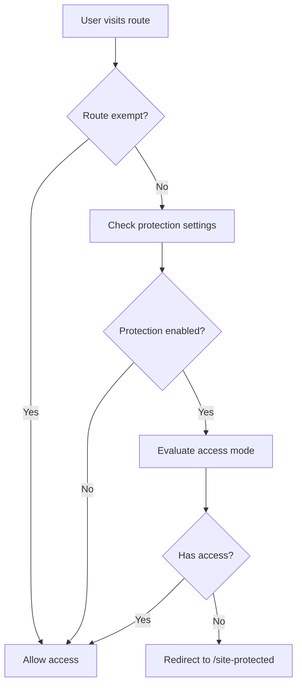
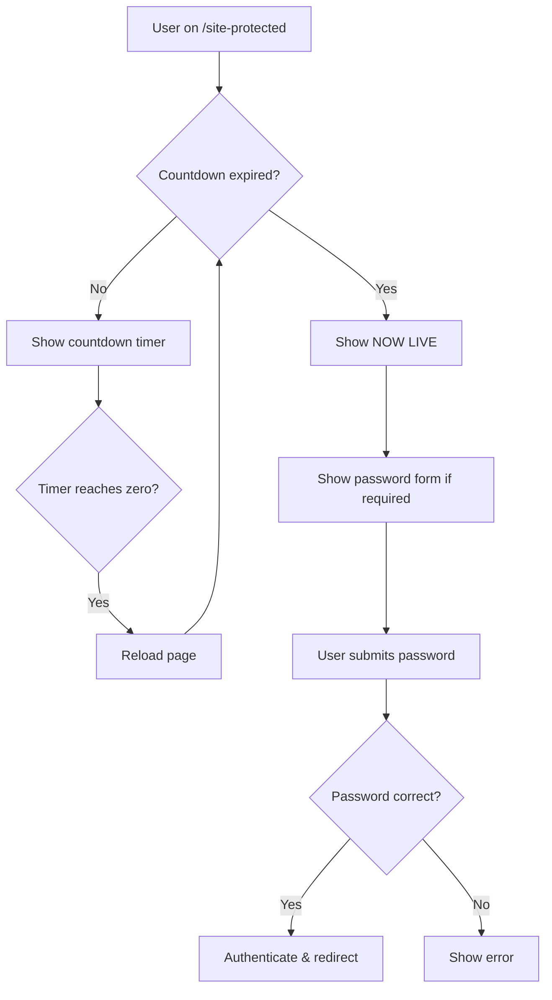

# Site Protection Service Specification

## Overview

The site protection service provides comprehensive access control for the entire application, supporting password authentication, time-based countdown access, and hybrid approaches. It integrates with Sanity CMS for configuration and uses Remix sessions for authentication state management.

## Architecture

### Core Components

1. **Server-Side Guard** (`app/lib/guards/site-protection.server.ts`)
2. **Protected Page Route** (`app/routes/($locale).site-protected.tsx`)
3. **Session Management** (password authentication)
4. **Sanity CMS Integration** (configuration storage)

## Data Structures

### SiteProtectionSettings
```typescript
interface SiteProtectionSettings {
  enabled?: boolean;
  accessMode?: 'password' | 'countdown' | 'both' | 'either';
  password?: string;
  countdown?: string; // ISO date string
  title?: any[]; // Localized content
  message?: any[]; // Localized content
  countdownLabel?: any[]; // Localized content
  passwordLabel?: any[]; // Localized content
  redirectPage?: {
    _ref?: string;
    _type?: string;
  };
  mediaType?: 'image' | 'video';
  backgroundImage?: any;
  backgroundVideo?: any;
  overlayOpacity?: number; // 0-100
  colorScheme?: ColorScheme;
}
```

### ColorScheme
```typescript
interface ColorScheme {
  _id?: string;
  name?: string;
  background?: { hex: string; rgb: { r: number; g: number; b: number; } };
  foreground?: { hex: string; rgb: { r: number; g: number; b: number; } };
  primary?: { hex: string; rgb: { r: number; g: number; b: number; } };
  primaryForeground?: { hex: string; rgb: { r: number; g: number; b: number; } };
  border?: { hex: string; rgb: { r: number; g: number; b: number; } };
  card?: { hex: string; rgb: { r: number; g: number; b: number; } };
  cardForeground?: { hex: string; rgb: { r: number; g: number; b: number; } };
}
```

## Access Modes

| Mode | Description | Access Logic |
|------|-------------|--------------|
| `password` | Password-only protection | Requires valid password authentication |
| `countdown` | Time-based protection | Requires countdown timer to expire |
| `both` | Combined protection | Requires BOTH password AND countdown expiry |
| `either` | Flexible protection | Requires password OR countdown expiry |

## Server-Side Guard

### Function: `requireUnprotectedAccess(context, request)`

**Purpose**: Middleware function that checks if users should have access to protected routes.

**Behavior**:
1. **Route Exemption**: Skips protection for system routes (`/cms`, `/api`, `/robots.txt`, etc.)
2. **Settings Query**: Fetches protection configuration from Sanity
3. **Protection Check**: Evaluates user access based on mode and credentials
4. **Redirect Logic**: Redirects unauthorized users to `/site-protected` with return URL

**Exempt Routes**:
- `/cms` - CMS access
- `/site-protected` - Protection page itself
- `/api/*` - API endpoints
- `/robots.txt` - SEO
- `/sitemap.xml` - SEO
- `/_assets/*` - Static assets
- `/favicon*` - Icons

## Protected Page Route

### Loader Function
**Responsibilities**:
- Query protection settings with expanded color scheme and media
- Check existing authentication state
- Determine access permissions
- Redirect if access is granted
- Return protection data for rendering

**Access Decision Logic**:
```typescript
switch (protection.accessMode) {
  case 'password': hasAccess = hasPasswordAuth; break;
  case 'countdown': hasAccess = countdownExpired; break;
  case 'both': hasAccess = hasPasswordAuth && countdownExpired; break;
  case 'either': hasAccess = hasPasswordAuth || countdownExpired; break;
}
```

### Action Function
**Responsibilities**:
- Handle password form submissions
- Validate passwords against Sanity settings
- Authenticate user sessions
- Handle post-authentication redirects

### Client-Side Features

#### Countdown Timer
- **Real-time Updates**: Updates every second using `setInterval`
- **Expiry Handling**: Triggers page reload when countdown reaches zero
- **Display Logic**: Shows "NOW LIVE" when expired (prevents reload loops)
- **Format**: Days:Hours:Minutes:Seconds with zero-padding

#### UI Customization
- **Dynamic Theming**: CSS custom properties from color scheme
- **Background Media**: Support for images and videos with overlay opacity
- **Localized Content**: Multi-language support for all text fields
- **Responsive Design**: Mobile-first approach with breakpoint handling

#### Form Handling
- **Password Input**: Secure password field with validation
- **Error Display**: Shows authentication errors
- **Redirect Preservation**: Maintains intended destination URL

## Session Management

### Password Authentication
- **Session Type**: Server-side sessions using Remix session management
- **Authentication Method**: `passwordSession.authenticate()`
- **State Check**: `passwordSession.isAuthenticated()`
- **Cookie Handling**: Secure session cookies with commit/destroy lifecycle

## Integration Points

### Sanity CMS Queries

**Protection Settings Query**:
```groq
*[_type == "settings"][0]{
  siteProtection {
    ...,
    backgroundVideo {
      ...,
      asset->
    },
    colorScheme-> {
      _id,
      name,
      background { hex, rgb { r, g, b } },
      foreground { hex, rgb { r, g, b } },
      primary { hex, rgb { r, g, b } },
      primaryForeground { hex, rgb { r, g, b } },
      border { hex, rgb { r, g, b } },
      card { hex, rgb { r, g, b } },
      cardForeground { hex, rgb { r, g, b } }
    }
  }
}
```

**Page Redirect Query**:
```groq
*[_id == $ref][0]{
  _type,
  "slug": slug.current,
  "handle": store.slug.current
}
```

## Security Considerations

### Password Security
- Passwords stored in Sanity CMS (consider hashing in production)
- Session-based authentication prevents password re-entry
- Secure session cookie configuration

### Cache Control
- `Cache-Control: no-cache, no-store, must-revalidate` headers on redirects
- Prevents caching of authentication decisions

### Input Validation
- URL parameter sanitization for redirect handling
- Form data validation for password submissions

## Configuration Examples

### Password-Only Protection
```javascript
{
  enabled: true,
  accessMode: 'password',
  password: 'secret123',
  title: 'Private Access Required',
  message: 'Enter password to continue'
}
```

### Countdown-Only Protection
```javascript
{
  enabled: true,
  accessMode: 'countdown',
  countdown: '2024-12-25T00:00:00Z',
  title: 'Coming Soon',
  countdownLabel: 'Launching in...'
}
```

### Hybrid Protection (Both Required)
```javascript
{
  enabled: true,
  accessMode: 'both',
  password: 'secret123',
  countdown: '2024-12-25T00:00:00Z',
  title: 'Exclusive Early Access',
  message: 'Password required even after launch'
}
```

### Flexible Protection (Either Condition)
```javascript
{
  enabled: true,
  accessMode: 'either',
  password: 'earlyaccess',
  countdown: '2024-12-25T00:00:00Z',
  title: 'Early Access Available',
  message: 'Enter password for immediate access or wait for public launch'
}
```

## Error Handling

### Client-Side
- **Network Errors**: Graceful degradation for Sanity query failures
- **Timer Precision**: Handles client/server time discrepancies
- **Hydration**: Prevents SSR/client mismatch for countdown display

### Server-Side
- **Missing Settings**: Defaults to allowing access if protection not configured
- **Invalid Dates**: Treats malformed countdown dates as expired
- **Session Errors**: Graceful fallback to unauthenticated state

## Performance Considerations

### Caching Strategy
- Protection settings cached at request level
- Color scheme CSS generated server-side
- Background media lazy-loaded with priority hints

### Bundle Optimization
- Countdown logic client-side only (no SSR overhead)
- Conditional loading of media components
- CSS-in-JS for dynamic theming

## Implementation Flow

### 1. Route Protection Flow


### 2. Authentication Flow


## File Structure

```text
app/
├── lib/
│   └── guards/
│       └── site-protection.server.ts    # Server-side protection logic
├── routes/
│   └── ($locale).site-protected.tsx     # Protected page route
├── components/
│   ├── media-field.tsx                  # Background media component
│   └── ui/
│       ├── button.tsx                   # Form button component
│       └── input.tsx                    # Form input component
└── hooks/
    └── use-colors-css-vars.tsx          # Dynamic theming hook
```

## Testing Scenarios

### Access Mode Testing
1. **Password Mode**: Verify password-only access works
2. **Countdown Mode**: Test timer expiry and access grant
3. **Both Mode**: Ensure both conditions must be met
4. **Either Mode**: Verify either condition grants access

### UI Testing
1. **Countdown Display**: Verify real-time timer updates
2. **NOW LIVE State**: Test post-expiry display
3. **Theming**: Verify color scheme application
4. **Background Media**: Test image/video display with overlay

### Edge Cases
1. **Invalid Countdown**: Test malformed date handling
2. **Session Persistence**: Verify authentication across page reloads
3. **Redirect Preservation**: Test return URL functionality
4. **Mobile Responsive**: Verify mobile layout and interactions

This specification provides a complete framework for implementing site-wide access control with flexible authentication modes, rich customization options, and robust security practices.
